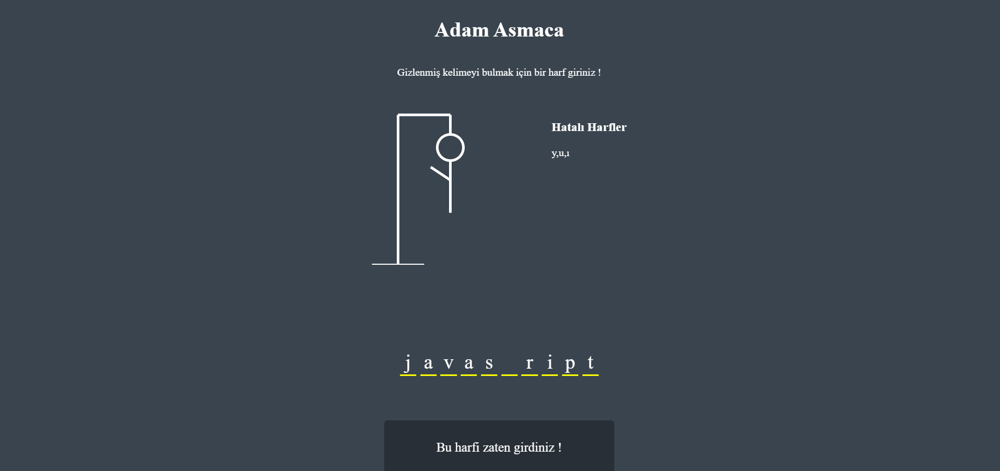

# Adam Asmaca (Hangman Game)

Gizli bir kelimeyi tahmin ederek "Adam Asmaca" oyununu oynayabileceğiniz, basit ama eğlenceli bir oyun.

## Proje Konusu

Bu proje, kullanıcının gizli bir kelimeyi doğru tahmin etmeye çalıştığı klasik **Adam Asmaca** oyununu web platformunda sunmak için geliştirilmiştir. Kullanıcı, yanlış tahminlerde bulundukça "adam" figürü çizilmeye başlar.Girilen harf tekrar girilmeye çalışıldığında uyarı mesajı verir. Doğru kelimeyi bulunduğunda oyun sona erer.

## Neden Geliştirildi : Motivasyon

Bu uygulamayı geliştirme motivasyonum, **JavaScript ve web geliştirme becerilerimi geliştirmekti**. Ayrıca, kullanıcı etkileşimi ve görsel dinamikler konusunda deneyim kazanmak amacıyla bu projeyi seçtim.

## Ne Öğrendim?

Bu projeyi geliştirirken aşağıdaki konularda bilgi ve deneyim kazandım:

- **HTML, CSS, JavaScript** ile temel web uygulamaları geliştirme.
- **DOM manipülasyonu** ile oyun içi dinamik etkileşimler oluşturma.
- **Local Storage** kullanarak oyuncu verilerini kaydetme.
- **Oyun mantığı** ve kullanıcı etkileşimi ile ilgili deneyim kazanma.

## Ekran Görüntüleri

